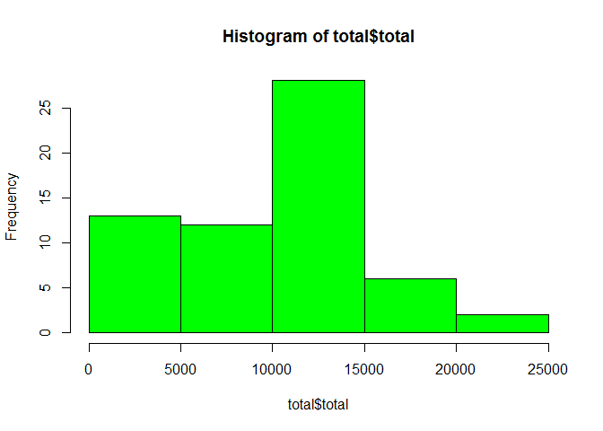
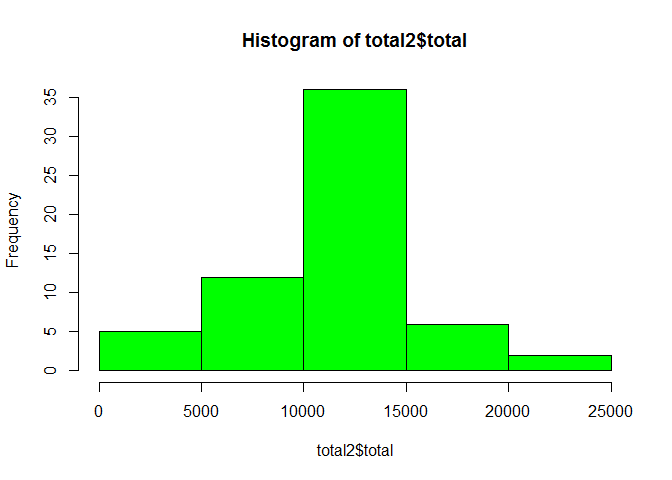
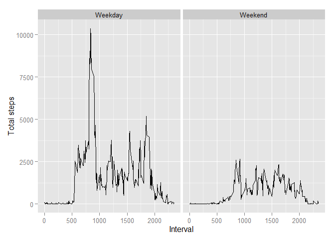

# Reproducible Research: Peer Assessment 1


## Loading and preprocessing the data

Load the data form file:


```r
data <- read.csv("activity.csv")
```

Load dplyr for grouping the data:


```r
library(dplyr)
```

```
## 
## Attaching package: 'dplyr'
## 
## The following object is masked from 'package:stats':
## 
##     filter
## 
## The following objects are masked from 'package:base':
## 
##     intersect, setdiff, setequal, union
```

## What is mean total number of steps taken per day?

Group the data:

```r
data1 <- group_by(data,date)
total <- summarize(data1,total=sum(steps, na.rm=TRUE))
```
Plot the histogramm:

```r
hist(total$total, col="green")
```

 

What is the mean?

```r
mean(total$total)
```

```
## [1] 9354.23
```

And the median?

```r
median(total$total)
```

```
## [1] 10395
```

## What is the average daily activity pattern?


```r
data2 <- group_by(data,interval)
avsteps <- summarize(data2,avs=mean(steps, na.rm=TRUE))

with(avsteps,{plot(interval,avs,type="l", xlab="Interval", ylab="Steps")})
```

 

Which interval contains the highest number of steps?

```r
head(arrange(avsteps, desc(avs)),1)
```

```
## Source: local data frame [1 x 2]
## 
##   interval      avs
## 1      835 206.1698
```

## Imputing missing values

How many "na's" do we have in the data?

```r
sum(is.na(data))
```

```
## [1] 2304
```
Perparing the data, replacement of the "na's" with the mean of the interval:

```r
nas <- is.na(data$steps)
data <- cbind(data,nas)
mdata <- merge(data,avsteps)
nadata <- subset(mdata,mdata$nas=="TRUE")
adata <- subset(mdata,mdata$nas=="FALSE")
nadata <- mutate(nadata,steps=avs)
data <- rbind(adata,nadata)
data3 <- group_by(data,date)

total2 <- summarize(data3,total=sum(steps, na.rm=TRUE))
```
Printing the histogramm:

```r
hist(total2$total, col="green")
```

 

What is the mean?

```r
mean(total2$total)
```

```
## [1] 10766.19
```

And the median?

```r
median(total2$total)
```

```
## [1] 10766.19
```


## Are there differences in activity patterns between weekdays and weekends?

Preparing the data:

```r
data4 <- mutate(data, week="Weekday")
data4 <- mutate(data4, day=weekdays(as.Date(data4$date),abbreviate=TRUE))
data4[,"week"][data4[,"day"]=="Sa"] <-"Weekend"
data4[,"week"][data4[,"day"]=="So"] <-"Weekend"
data4 <- group_by(data4,interval,week)
total3 <- summarize(data4,total=sum(steps))
```

Printing the comparison with ggplot:

```r
library(ggplot2)
```

```
## Warning: package 'ggplot2' was built under R version 3.2.1
```

```r
g <- ggplot(total3, aes(interval,total))
g+geom_line()+facet_grid(.~week)+labs(x="Interval",y="Total steps")
```

 

Conclusion: There is a higher avctiviy during weekdays.
